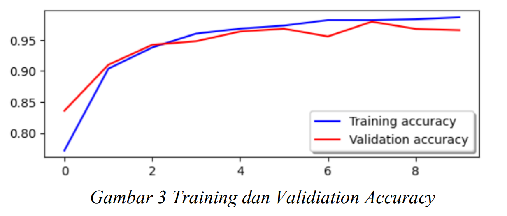

# *MiniProject2_Team8*

## Team Member:
  1. Muhammad Surya Sanjiwani
  2. Septiaini Dela Subiakto
  3. Reva Santika
  4. Ovi Candra Wardianto

## Source Code

### Conclusion Source Code

Based on the training and evaluation results of the CNN model on HAM10000, the training model shows good performance with low training and validation loss (4.64% and 10.64%, respectively) and high accuracy for both (98.65% and 96.59%, respectively). In the final results of this training model, the test accuracy is 96.42% and the test loss is 11.94%.

## Source Code Before Upsampling 

This repository contains assignments by Team 8.

